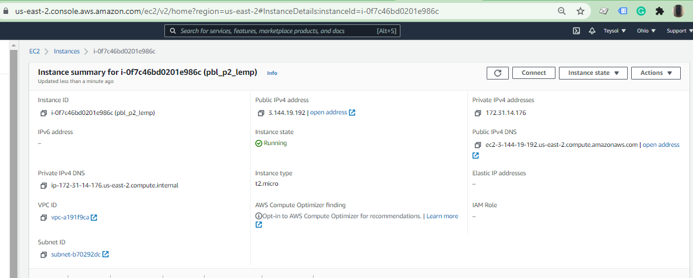
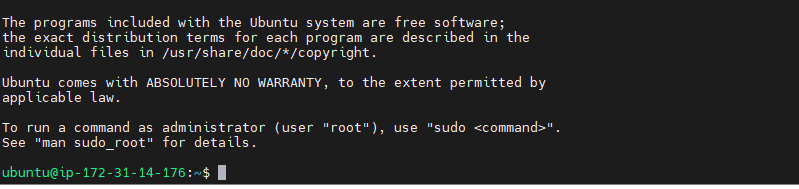
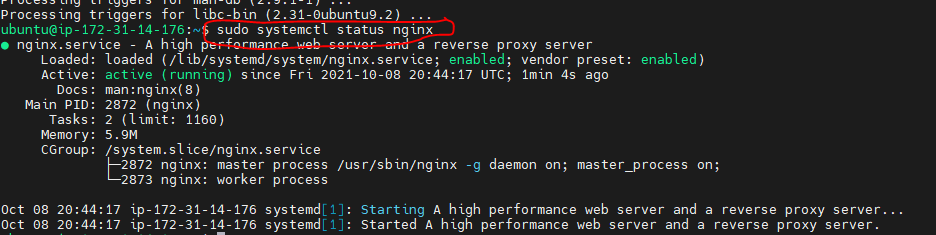
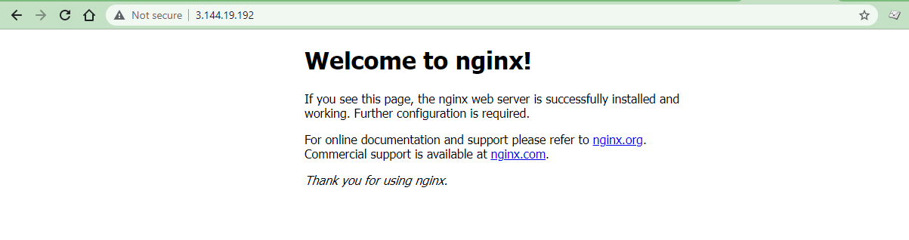
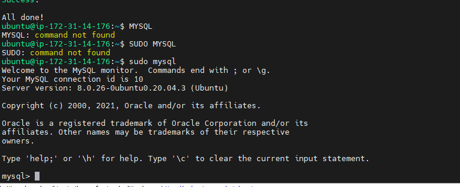
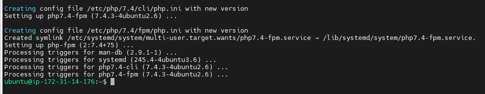
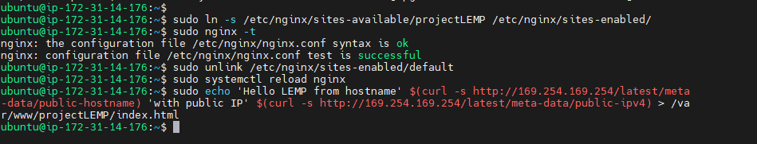
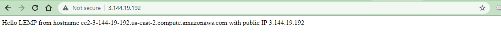

# WEB STACK IMPLEMENTATION (LEMP STACK)

### LEMP stands for a technology stack tool suite with Linux running as the OS; NGINX as the webserver; MySQL as the database; PHP/Python/Perl as the server-side scripting language 

### NGINX is an open source reverse proxy server for HTTP, HTTPS, SMTP, POP3, and IMAP protocols. It also functions as a load balancer, HTTP cache, and web server (origin server).

#### Step 0 – Spun-off EC2 Linux Ubuntu Server and Applied basic configurations

Launched EC2 instance of Linux Ubuntu Server 20.04 LTS (HVM) and named it as pbl_p2_lemp. Created security group with relevant ports opened and also created and saved my private key to be used for SSH into the EC2 instance.

*EC2 Instance Linux Ubuntu Server 20.04 1 CPU 8G Storage*

*SSH into EC2 Server*

### Step 1: Installing the Nginx Web Server

`sudo apt update`

`sudo apt install nginx`

`sudo systemctl status nginx`

*NGINX installation & validation*

### Step 2: Installing MySQL Server

MySQl server is installed, validated and password set

`sudo apt install mysql-server`

`sudo mysql_secure_installation`

*NGINX installation & validation*

### Step 3: Installing PHP

`sudo apt install php-fpm php-mysql`

*PHP installation*

### Step 4 — Configuring Nginx to Use PHP Processor

`#Creating virtual hosts `
`Create the root web directory for your_domain as follows:`

`sudo mkdir /var/www/projectLEMP`

`#open a new configuration file in Nginx’s sites-available directory using nano editor`

`#/etc/nginx/sites-available/projectLEMP`

`server {`
`   listen 80;`
`   server_name projectLEMP www.projectLEMP;`
`   root /var/www/projectLEMP;`

`   index index.html index.htm index.php;`

`   location / {`
`       try_files $uri $uri/ =404;`
`   }`

`   location ~ \.php$ {`
`       include snippets/fastcgi-php.conf;`
`       fastcgi_pass unix:/var/run/php/php7.4-fpm.sock;`
`    }`

`   location ~ /\.ht {`
`       deny all;`
`   }`

`}`

*virtualhost created & verified*

